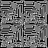
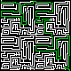

# Maze Solver App

This source code allows to solve a maze from a black and white image format. Then once is done, it will markdown the path from start to exit.

## Getting Started

To run the program, clone the repo or download.

 Make sure to check the path before running the main program, update the `path` with your respective file structure.

`ImageProcess.java`

First
```java
 16 | image = ImageIO.read(new File("path/images/puzzleDone.png");
```
Then
```java
 48 | File file = new File("path/images/mazeDone.png");
```
For the momment this has to be done manually, however, it will be changed once the GUI is ready.

### Considerations
- The `start` and `end`ing position must be given for the time being
- The maze must be a square `l by l`


### To do list

- [x] Implement DFS algorithm
- [ ] Implement BFS algorithm
- [ ] Determinate start and ending position from the image
- [ ] Allow any shape maze image
- [ ] Auto generate random maze images
- [ ] GUI

### Preview

Input



Output

